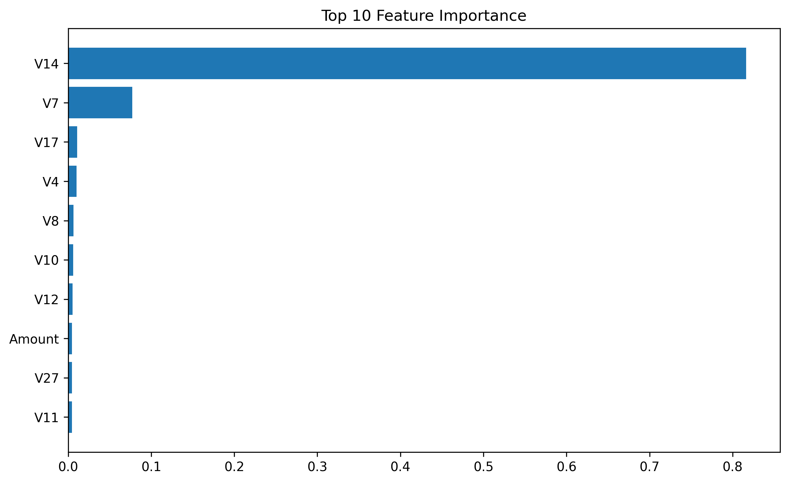
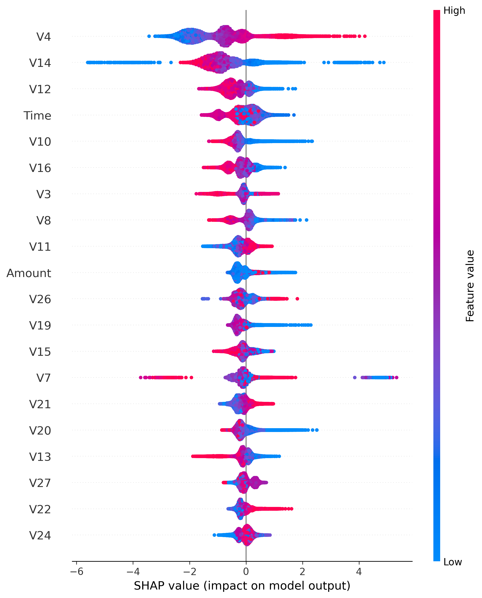
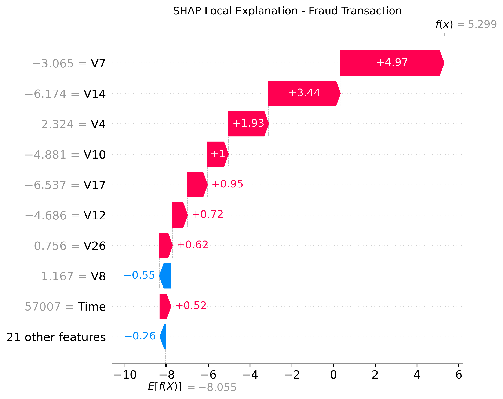

# Fraud Detection with Explainable AI

## Overview

A Machine Learning project for detecting fraudulent credit card transactions using supervised learning models and Explainable AI techniques.

The goal is not only to detect fraud but also to explain why the model makes each decision.

## Project Pipeline

Data Loading  
↓  
Data Preprocessing  
↓  
Train/Test Split  
↓  
Feature Scaling  
↓  
SMOTE Handling  
↓  
Model Training  
↓  
Model Evaluation  
↓  
SHAP Explainability  
↓  
Prediction API


## Dataset

Credit Card Fraud Detection Dataset

- Transactions: 284,807
- Features: 30
- Target: Class

Class:
- 0 = Legitimate Transaction
- 1 = Fraudulent Transaction


## Machine Learning Models

Models trained:

- Logistic Regression
- Logistic Regression + SMOTE
- XGBoost Classifier


## Best Model

XGBoost Classifier


## Performance

| Metric | Score |
|---|---|
| ROC-AUC | 0.9646 |
| Precision | 0.93 |
| Recall | 0.79 |
| F1-score | 0.85 |


## Explainable AI - SHAP

SHAP was used to explain model predictions.

### Feature Importance




### SHAP Summary Plot




### SHAP Local Explanation

Example:

Prediction:
Fraud

Fraud Probability:
0.995





## Project Structure
fraud-detection-explainable-ai/

data/
models/
images/
notebooks/
src/

README.md
requirements.txt


## Prediction API

The project includes:


src/predict.py


Example:

```python
from src.predict import predict_transaction

result = predict_transaction(transaction)

print(result)
Technologies
Python
Pandas
NumPy
Scikit-learn
XGBoost
SHAP
Matplotlib
Seaborn
Installation
pip install -r requirements.txt
Future Improvements
FastAPI deployment
Dashboard creation
Real-time fraud monitoring
Model monitoring
Author

Yassin Bera

Machine Learning | Explainable AI | Fraud Detection
